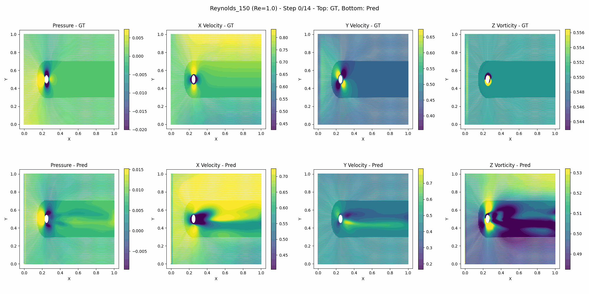

# G-PARC: Physics-Aware Deep Learning for Complex Simulations

This repository contains the code and results for a deep learning model designed to forecast and simulate complex physical phenomena. The model is applied to various scenarios, including river flooding, shock wave propagation, and fluid dynamics.

---

## ## Demonstrations

Here are several demonstrations of the model's capabilities on different datasets.

### ### White River Flood Forecasting 🌊

This animation shows the model's forecast for a flooding event on the White River. The model accurately predicts the inundation area and water level changes over time.


### ### Shock Tube Simulations 💥

The following GIFs compare the shock tube simulation results with varying time steps ($\Delta t$). This highlights the model's stability and accuracy under different simulation conditions.

**Small $\Delta t$:**


### ### 3D Cylinder Wake Visualization 💨

This is a visualization of the 3D vortex shedding phenomenon in the wake of a cylinder. The model captures the complex, turbulent flow structures in three dimensions. 



---

## ## Usage 🚀

To get started with this project, clone the repository and install the required dependencies.

1.  **Clone the repository:**
    ```bash
    git clone [https://github.com/JackBeerman/G-PARC.git](https://github.com/JackBeerman/G-PARC.git)
    cd G-PARC
    ```

2.  **Install dependencies:**
    ```bash
    pip install -r requirements.txt
    ```

3.  **Run a simulation:**
    ```bash
    python run_simulation.py --scenario cylinder
    ```